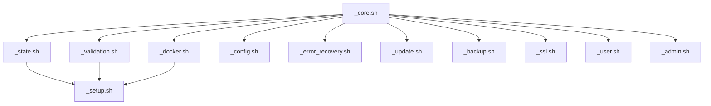

# Milou CLI API Reference

## 📋 Overview

This document provides comprehensive API documentation for all Milou CLI modules and their exported functions. The Milou CLI is built with a modular architecture where each module provides specific functionality through well-defined interfaces.

## 🏗️ Architecture Overview

```
milou-cli/
├── src/
│   ├── _core.sh          # Core utilities and logging
│   ├── _state.sh         # Installation state detection
│   ├── _docker.sh        # Docker operations management
│   ├── _config.sh        # Configuration management
│   ├── _validation.sh    # System validation
│   ├── _setup.sh         # Installation procedures
│   ├── _error_recovery.sh # Error recovery and rollback
│   ├── _update.sh        # Update and maintenance
│   ├── _backup.sh        # Backup and restore
│   ├── _ssl.sh           # SSL certificate management
│   ├── _user.sh          # User management
│   └── _admin.sh         # Administrative functions
```

## 🎯 Module Dependencies



---

## 📚 Core Module (_core.sh)

### Overview
The core module provides fundamental utilities, logging, and common functions used across all other modules.

### Key Functions

#### Logging Functions
```bash
milou_log(level, message)
```
- **Purpose**: Unified logging with timestamps and colored output
- **Parameters**: 
  - `level`: LOG_LEVEL (INFO, WARN, ERROR, SUCCESS, DEBUG, STEP, TRACE)
  - `message`: Log message string
- **Returns**: None
- **Example**: `milou_log "INFO" "Starting setup process"`

#### Utility Functions
```bash
ensure_directory(path, permissions)
```
- **Purpose**: Create directory with proper permissions
- **Parameters**:
  - `path`: Directory path to create
  - `permissions`: Optional permissions (default: 755)
- **Returns**: 0 on success, 1 on failure

```bash
generate_secure_password(length)
```
- **Purpose**: Generate cryptographically secure password
- **Parameters**: `length`: Password length (default: 32)
- **Returns**: Generated password string

---

## 🔍 State Detection Module (_state.sh)

### Overview
Smart installation state detection system for intelligent setup decisions.

### State Types
- `fresh`: No Milou installation detected
- `running`: Milou is running and healthy
- `installed_stopped`: Installed but not running
- `configured_only`: Has config but no containers
- `containers_only`: Has containers but no config
- `broken`: Installation exists but is broken

### Key Functions

#### detect_installation_state(force_refresh, quiet)
```bash
detect_installation_state(force_refresh, quiet)
```
- **Purpose**: Master state detection function
- **Parameters**:
  - `force_refresh`: Force cache refresh (default: false)
  - `quiet`: Suppress logging (default: false)
- **Returns**: Current installation state
- **Caching**: 30-second TTL for performance

#### smart_setup_mode(installation_state, force, quiet)
```bash
smart_setup_mode(installation_state, force, quiet)
```
- **Purpose**: Determine appropriate setup mode based on state
- **Parameters**:
  - `installation_state`: Current state from detect_installation_state
  - `force`: Force reinstall flag (default: false)
  - `quiet`: Suppress logging (default: false)
- **Returns**: Recommended setup mode

---

## 🐳 Docker Operations Module (_docker.sh)

### Overview
Consolidated Docker operations with standardized error handling and health checking.

### Key Functions

#### docker_execute(action, args, quiet)
```bash
docker_execute(action, args, quiet)
```
- **Purpose**: Master function for all Docker Compose operations
- **Parameters**:
  - `action`: Docker Compose action (up, down, ps, logs, etc.)
  - `args`: Additional arguments for the action
  - `quiet`: Suppress output (default: false)
- **Returns**: 0 on success, 1 on failure
- **Actions Supported**: up, down, restart, pull, logs, ps, exec, config, validate

#### health_check_service(service_name, quiet)
```bash
health_check_service(service_name, quiet)
```
- **Purpose**: Check health of individual service
- **Parameters**:
  - `service_name`: Name of service to check
  - `quiet`: Suppress output (default: false)
- **Returns**: 0 if healthy, 1 if unhealthy

#### health_check_all(quiet)
```bash
health_check_all(quiet)
```
- **Purpose**: Comprehensive health check of all services
- **Parameters**: `quiet`: Suppress output (default: false)
- **Returns**: 0 if all healthy, 1 if any unhealthy

---

## ⚙️ Configuration Module (_config.sh)

### Overview
Manages environment configuration, validation, and secure credential handling.

### Key Functions

#### config_generate(domain, ssl_mode, overwrite)
```bash
config_generate(domain, ssl_mode, overwrite)
```
- **Purpose**: Generate complete environment configuration
- **Parameters**:
  - `domain`: Primary domain name
  - `ssl_mode`: SSL configuration (letsencrypt, custom, none)
  - `overwrite`: Overwrite existing config (default: false)
- **Returns**: 0 on success, 1 on failure

#### config_validate(env_file, mode, quiet)
```bash
config_validate(env_file, mode, quiet)
```
- **Purpose**: Validate configuration file completeness
- **Parameters**:
  - `env_file`: Path to environment file
  - `mode`: Validation level (minimal, standard, comprehensive)
  - `quiet`: Suppress output (default: false)
- **Returns**: 0 if valid, 1 if invalid

---

## 🔧 Setup Module (_setup.sh)

### Overview
Intelligent installation and setup procedures with state-aware decision making.

### Key Functions

#### milou_setup_main(options...)
```bash
milou_setup_main(options...)
```
- **Purpose**: Main setup entry point with contextual flow
- **Parameters**: Various setup options (--force, --preserve-credentials, etc.)
- **Returns**: 0 on success, 1 on failure
- **Features**: State detection, smart defaults, interactive guidance

#### setup_create_environment(domain, ssl_mode, preserve_credentials)
```bash
setup_create_environment(domain, ssl_mode, preserve_credentials)
```
- **Purpose**: Create or update environment configuration
- **Parameters**:
  - `domain`: Primary domain
  - `ssl_mode`: SSL configuration mode
  - `preserve_credentials`: Keep existing credentials (default: true)
- **Returns**: 0 on success, 1 on failure

---

## 🛡️ Error Recovery Module (_error_recovery.sh)

### Overview
Enterprise-grade error recovery system with automatic rollback capabilities.

### Key Functions

#### create_system_snapshot(snapshot_name)
```bash
create_system_snapshot(snapshot_name)
```
- **Purpose**: Create complete system state snapshot
- **Parameters**: `snapshot_name`: Name for the snapshot
- **Returns**: 0 on success, 1 on failure
- **Includes**: Configuration, Docker state, service status

#### safe_operation(operation_function, rollback_function, description)
```bash
safe_operation(operation_function, rollback_function, description)
```
- **Purpose**: Execute operation with automatic rollback on failure
- **Parameters**:
  - `operation_function`: Function to execute safely
  - `rollback_function`: Function to call on failure
  - `description`: Human-readable operation description
- **Returns**: Result of operation_function

---

## 🔄 Update Module (_update.sh)

### Overview
Smart update system with semantic versioning and enhanced backup integration.

### Key Functions

#### smart_update_detection(target_version, specific_services, github_token, check_only)
```bash
smart_update_detection(target_version, specific_services, github_token, check_only)
```
- **Purpose**: Intelligent update analysis with impact assessment
- **Parameters**:
  - `target_version`: Target version to update to (default: latest)
  - `specific_services`: Comma-separated service list
  - `github_token`: GitHub authentication token
  - `check_only`: Only check, don't perform update
- **Returns**: 0 if update needed, 1 if up-to-date

#### enhanced_update_process(target_version, specific_services, force_update, backup_before_update, github_token)
```bash
enhanced_update_process(target_version, specific_services, force_update, backup_before_update, github_token)
```
- **Purpose**: Complete update process with safety measures
- **Parameters**:
  - `target_version`: Version to update to
  - `specific_services`: Services to update
  - `force_update`: Force update even if unnecessary
  - `backup_before_update`: Create backup before updating
  - `github_token`: Authentication token
- **Returns**: 0 on success, 1 on failure

---

## 📦 Backup Module (_backup.sh)

### Overview
Comprehensive backup and disaster recovery system with automated scheduling.

### Key Functions

#### milou_backup_create(backup_type, backup_dir, backup_name)
```bash
milou_backup_create(backup_type, backup_dir, backup_name)
```
- **Purpose**: Create comprehensive system backup
- **Parameters**:
  - `backup_type`: Type of backup (full, config, data, ssl)
  - `backup_dir`: Directory to store backup (default: ./backups)
  - `backup_name`: Custom backup name
- **Returns**: Path to created backup file

#### disaster_recovery_restore(backup_source, recovery_mode, target_services)
```bash
disaster_recovery_restore(backup_source, recovery_mode, target_services)
```
- **Purpose**: One-click disaster recovery with guided restoration
- **Parameters**:
  - `backup_source`: Backup source (auto, file, cloud)
  - `recovery_mode`: Recovery type (interactive, auto, minimal)
  - `target_services`: Services to restore
- **Returns**: 0 on success, 1 on failure

---

## 🔐 SSL Module (_ssl.sh)

### Overview
SSL certificate management with Let's Encrypt integration and custom certificate support.

### Key Functions

#### ssl_generate_certificates(domain, ssl_mode, email)
```bash
ssl_generate_certificates(domain, ssl_mode, email)
```
- **Purpose**: Generate SSL certificates based on mode
- **Parameters**:
  - `domain`: Primary domain for certificates
  - `ssl_mode`: Certificate mode (letsencrypt, custom, none)
  - `email`: Email for Let's Encrypt registration
- **Returns**: 0 on success, 1 on failure

---

## 👥 User Module (_user.sh)

### Overview
User management and permission handling for Milou installation.

### Key Functions

#### create_milou_user(username, add_to_docker_group)
```bash
create_milou_user(username, add_to_docker_group)
```
- **Purpose**: Create system user for Milou operations
- **Parameters**:
  - `username`: Username to create
  - `add_to_docker_group`: Add user to docker group (default: true)
- **Returns**: 0 on success, 1 on failure

---

## 🔍 Validation Module (_validation.sh)

### Overview
System validation and dependency checking with auto-fix capabilities.

### Key Functions

#### validate_system_dependencies(mode, installation_state, quiet)
```bash
validate_system_dependencies(mode, installation_state, quiet)
```
- **Purpose**: Comprehensive system dependency validation
- **Parameters**:
  - `mode`: Validation mode (basic, standard, comprehensive)
  - `installation_state`: Current system state
  - `quiet`: Suppress output (default: false)
- **Returns**: 0 if valid, 1 if validation failed

---

## 📊 Usage Examples

### Basic Usage
```bash
# Load core functionality
source "src/_core.sh"
source "src/_state.sh"

# Detect current state
current_state=$(detect_installation_state)
echo "Current state: $current_state"

# Get recommended setup mode
setup_mode=$(smart_setup_mode "$current_state")
echo "Recommended action: $setup_mode"
```

### Advanced Usage
```bash
# Comprehensive system validation
source "src/_validation.sh"
if validate_system_dependencies "comprehensive" "$current_state"; then
    echo "System is ready for operations"
else
    echo "System needs attention"
fi

# Safe operation with automatic rollback
source "src/_error_recovery.sh"
safe_operation \
    "milou_backup_create full" \
    "echo 'Backup failed, cleaning up'" \
    "Creating system backup"
```

---

## 🚦 Error Handling

All Milou CLI functions follow consistent error handling patterns:

- **Return Codes**: 0 for success, 1 for failure
- **Logging**: Consistent error messages with context
- **Recovery**: Automatic cleanup on failures where possible
- **Safety**: Operations are safe by default with explicit flags for destructive actions

---

## 🧪 Testing

Each module has comprehensive test coverage:

- **Unit Tests**: Individual function testing
- **Integration Tests**: Module interaction testing
- **Performance Tests**: Speed and resource usage validation
- **Error Handling Tests**: Failure scenario validation

For test execution:
```bash
# Run all tests
./tests/run-all-tests.sh

# Run specific module tests
./tests/unit/test-core-module.sh
```

---

## 📄 License

This API documentation is part of the Milou CLI project, released under the MIT License.

---

**Generated**: January 2025  
**Version**: 4.0.0  
**Last Updated**: Week 5 Implementation 